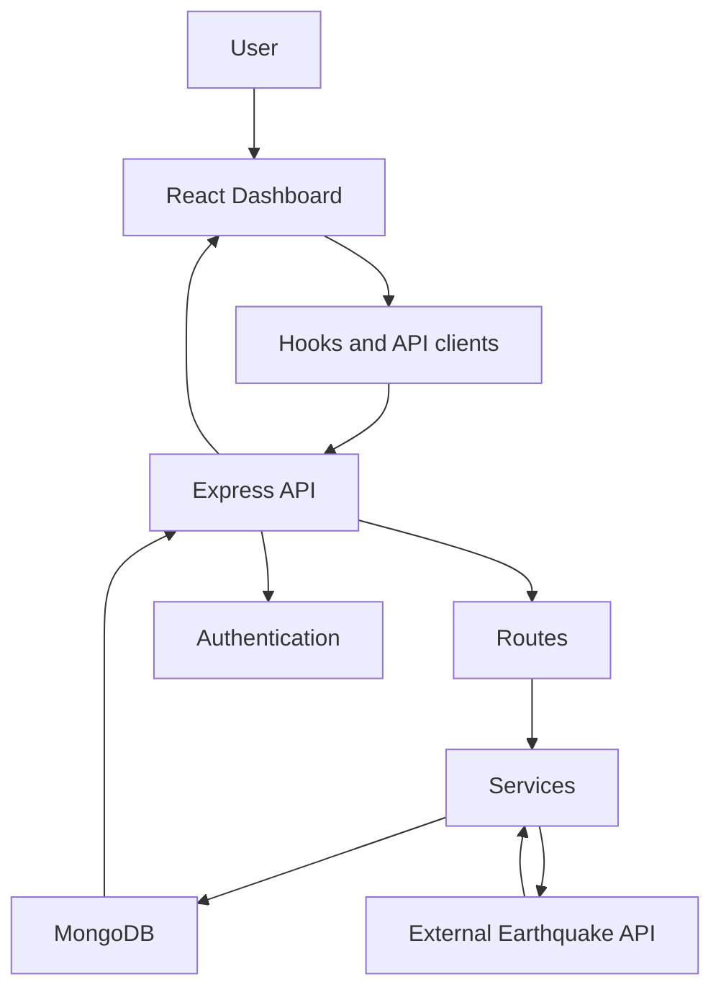

# GeoPulse Project Implementation Report

## Chapter 1: Project Introduction

GeoPulse is an earthquake monitoring system that helps users understand live and historical seismic activity. The project combines a React dashboard, Node/Express backend, MongoDB storage, external earthquake data, maps, charts, authentication, and an AI assistant.

The main objective is to present earthquake information in a form ordinary users can understand while preserving source-data accuracy.

Scope:

- Live earthquake monitoring.
- Dashboard overview.
- Live feed and maps.
- Historical earthquake search.
- Pakistan Historical Analytics.
- Earthquake details.
- Nearby earthquake discovery.
- Safety guidance.
- AI assistant support.

Limitations:

- GeoPulse is not an official warning agency.
- Historical Pakistan analytics currently uses a broad Pakistan-area bounding box.
- Earthquake values may be revised by scientific data providers.

## Chapter 2: Requirements Analysis

Functional requirements:

- Register and log in users.
- Fetch live earthquake data.
- Display dashboard cards, maps, charts, and records.
- Search, filter, sort, and inspect earthquakes.
- Show live and historical analytics separately.
- Store historical analytics records in MongoDB.
- Handle missing or invalid earthquake values safely.

Non-functional requirements:

- Responsive UI.
- Accurate source mapping.
- Maintainable code.
- Fast analytics responses.
- Clear error states.
- Secure authentication.
- Accessible charts and controls.

## Chapter 3: Technology Stack

- React: frontend page and component rendering.
- TypeScript: safer data contracts.
- Vite: fast frontend build tooling.
- Tailwind CSS: GeoPulse dashboard styling.
- Node.js and Express: backend API.
- MongoDB: persistent historical earthquake analytics storage.
- JWT/OAuth: authentication.
- Recharts: responsive dashboard charts.
- Map components: visual earthquake location display.
- USGS earthquake data: external earthquake source.

## Chapter 4: System Architecture



GeoPulse uses a layered architecture. Routes connect requests to services. Services own business logic, normalization, synchronization, and aggregation. Repositories own MongoDB access. The frontend uses pages, components, hooks, and API clients.

## Chapter 5: Frontend Implementation

The frontend is organized around dashboard pages and reusable components. The dashboard shell provides sidebar and navigation. Individual pages render overview, feeds, maps, history, analytics, safety, AI assistant, nearby earthquakes, alerts, and settings.

Pakistan Historical Analytics is separate from Live Analytics:

- Live Analytics keeps its existing live data behavior.
- Pakistan Historical Analytics uses `GET /api/analytics/dashboard`.
- The user switches views without replacing the dashboard route shell.

Charts are implemented with Recharts and split into focused files:

- Yearly frequency.
- Continuous monthly timeline.
- Calendar-month frequency.
- Magnitude distribution.
- Depth distribution.
- Year-month heatmap.

Loading, empty, and error states are shown directly on the page.

## Chapter 6: Backend Implementation

The backend uses Express routes and services. `backend/server.ts` mounts API route groups, including analytics. Analytics routes validate query parameters before calling services.

Historical Analytics endpoint:

- `GET /api/analytics/dashboard`

It returns:

- Metadata.
- Summary metrics.
- Yearly frequency.
- Monthly timeline.
- Calendar-month frequency.
- Magnitude distribution.
- Depth distribution.
- Year-month heatmap.
- Map events for future map use.

The endpoint is additive and does not replace live earthquake APIs.

## Chapter 7: Database Implementation

MongoDB stores imported historical earthquake analytics records in `analytics_earthquakes`. The repository uses USGS IDs to prevent duplicates and creates indexes for query performance.

Important query needs:

- Date range.
- Magnitude range.
- Depth range.
- Region/classification.
- Aggregation by year and month.

Indexes help avoid scanning the full collection for common dashboard filters.

## Chapter 8: Analytics Implementation

Analytics are generated server-side. This prevents the frontend from downloading the entire historical dataset and recalculating totals inconsistently.

Verification rule:

```text
summary total = yearly total = monthly total = heatmap total
```

Magnitude and depth distribution totals are verified against valid values returned by the backend.

The current default Pakistan historical dataset is expected to show `10,808` records with default filters.

## Chapter 9: Testing

Testing performed:

| Area | Check |
| --- | --- |
| Live Analytics | Preserved as a separate view |
| Historical switch | Live and Pakistan Historical views open independently |
| Default total | Historical API returns expected total |
| Chart totals | Summary, yearly, monthly, and heatmap totals match |
| Responsive UI | Desktop, tablet, and mobile layout checked |
| Empty state | Wide/narrow filters can show no results safely |
| Error state | API errors render a friendly retry state |
| Build | Production build passes |
| Lint | Lint passes |

Recommended automated tests:

- API query validation tests.
- Aggregation total consistency tests.
- Chart rendering tests.
- Authentication route protection tests.
- Map marker coordinate tests.

## Chapter 10: Deployment

Deployment requires:

- Frontend build command.
- Backend server command.
- MongoDB connection string.
- JWT secret.
- OAuth credentials where Google login is enabled.
- CORS configuration for production frontend URL.

Common risks:

- Missing environment variables.
- Incorrect OAuth callback URL.
- MongoDB network access restrictions.
- Large frontend chunks.
- API CORS mismatch.

## Chapter 11: Challenges and Solutions

| Challenge | Solution |
| --- | --- |
| Live and historical analytics could be mixed accidentally | Separate views and preserve live code |
| Historical data is large | Use MongoDB aggregations |
| Pakistan classification can be uncertain | Label as broad Pakistan-area bounding box |
| Chart readability problems | Use wider chart sections and clear axes |
| Duplicate records | Use USGS event ID |
| Missing alert or tsunami values | Preserve missing values instead of inventing safety labels |
| Rapid filter changes | Cancel stale requests |

## Chapter 12: Results and Evaluation

GeoPulse now supports a clearer separation between live earthquake monitoring and Pakistan Historical Analytics. Historical charts are wider, more readable, and powered by backend aggregation data. The implementation preserves live charts and routes while adding a dedicated historical analysis experience.

User benefits:

- Faster understanding of historical patterns.
- Clearer chart labels and sections.
- Safer data interpretation.
- Better submit-ready documentation.

## Chapter 13: Future Improvements

- Exact Pakistan point-in-polygon boundary classification.
- Historical map reintroduction after chart view is stable.
- Region/province grouping with clear derived-data labeling.
- Scheduled synchronization.
- Automated regression tests.
- Advanced map layers.
- Offline support.
- Mobile application.
- Multilingual guidance.
- Predictive analytics only with clear scientific limitations.

## Final implementation notes

Current implementation is intentionally conservative. It improves and documents Pakistan Historical Analytics without replacing Live Analytics, authentication, protected dashboard pages, or backend contracts.
