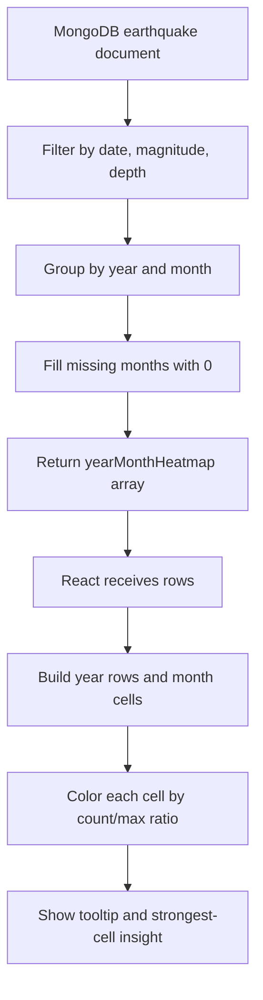

# Historical Analytics Data Parsing and Heatmap Guide

This document explains how Pakistan Historical Analytics data is parsed, how filters connect to the backend, and how the year-month heatmap is created.

## 1. What is used

### Frontend

- React and TypeScript for the dashboard page.
- Tailwind CSS for the GeoPulse glass UI and heatmap colors.
- Recharts for most Historical Analytics charts.
- A custom Tailwind grid for the heatmap.
- `AbortController` to cancel old requests when filters change quickly.

### Backend

- Express route: `GET /api/analytics/dashboard`
- MongoDB collection: `analytics_earthquakes`
- MongoDB aggregation pipeline with `$match`, `$facet`, `$group`, `$sort`, `$project`, `$year`, and `$month`.

### Data source

The Historical Analytics page does not calculate totals from fake frontend data. It receives prepared analytics from the backend. The backend reads historical earthquake documents stored in MongoDB.

## 2. Main files involved

| File | Purpose |
| --- | --- |
| `frontend/src/pages/Dashboard/Analytics/PakistanHistoricalAnalyticsPage.tsx` | Shows the Pakistan Historical Analytics page. |
| `frontend/src/pages/Dashboard/Analytics/analyticsTypes.ts` | Defines filter shape and default values. |
| `frontend/src/pages/Dashboard/Analytics/useHistoricalAnalytics.ts` | Connects filters to API requests and stores loading/error/data state. |
| `frontend/src/pages/Dashboard/Analytics/historicalAnalyticsApi.ts` | Converts filters into URL query parameters and calls the backend. |
| `backend/src/routes/analyticsRoutes.ts` | Defines `/api/analytics/dashboard`. |
| `backend/src/services/analytics/analyticsQuery.ts` | Validates and normalizes filters. |
| `backend/src/services/analytics/analyticsAggregationService.ts` | Builds summary cards, chart data, and heatmap data from MongoDB. |
| `frontend/src/pages/Dashboard/Analytics/components/HistoricalHeatmap.tsx` | Renders the heatmap cells. |

## 3. Default filters

Default filter values come from `createDefaultAnalyticsFilters()` in `analyticsTypes.ts`.

```ts
{
  region: 'pakistan',
  startDate: '1975-01-01',
  endDate: current date,
  minMagnitude: 4,
  maxMagnitude: null,
  minDepth: null,
  maxDepth: null
}
```

These defaults mean the first Historical Analytics view shows Pakistan-area earthquake records from 1975 to today with magnitude 4 or higher.

## 4. Filter-to-heatmap connection

```mermaid
flowchart LR
  A["User changes filters"] --> B["Draft filter state"]
  B --> C["Apply button"]
  C --> D["useHistoricalAnalytics updates filters"]
  D --> E["historicalAnalyticsApi builds query string"]
  E --> F["GET /api/analytics/dashboard"]
  F --> G["Backend validates filters"]
  G --> H["MongoDB $match uses filters"]
  H --> I["MongoDB groups records by year and month"]
  I --> J["Backend returns yearMonthHeatmap"]
  J --> K["HistoricalHeatmap renders cells"]
```



The important point is that the heatmap is not filtered separately in the browser. The same filters used for cards and charts are sent to the backend. The backend applies them once, then creates the heatmap from the filtered MongoDB records.

## 5. How filters become an API request

`historicalAnalyticsApi.ts` converts the filter object into URL parameters.

Example:

```text
/api/analytics/dashboard?region=pakistan&startDate=1975-01-01&endDate=2026-08-03&minMagnitude=4
```

Optional filters are only added when they have values:

- `maxMagnitude`
- `minDepth`
- `maxDepth`

So if a user sets maximum magnitude or depth filters, those values are included in the same request.

## 6. How stale requests are avoided

`useHistoricalAnalytics.ts` uses `AbortController`.

If the user changes filters quickly, the old request is cancelled before the new result is accepted. This prevents an older response from replacing newer heatmap data.

This matters because charts and heatmap must always match the latest selected filters.

## 7. Backend validation

`analyticsQuery.ts` validates the request before MongoDB is queried.

It checks:

- Date format is valid.
- Start date is not earlier than `1975-01-01`.
- End date is not in the future.
- Start date is not after end date.
- Minimum magnitude is not greater than maximum magnitude.
- Depth values are not negative.
- Minimum depth is not greater than maximum depth.
- Region is either `pakistan` or `global`.

Invalid filters return an error instead of creating misleading analytics.

## 8. How MongoDB filters the data

`analyticsAggregationService.ts` creates a MongoDB `$match` filter.

The filter includes:

- `occurredAt >= startDate`
- `occurredAt <= endDate`
- `magnitude >= minMagnitude`
- `magnitude <= maxMagnitude` when selected
- `depth >= minDepth` when selected
- `depth <= maxDepth` when selected

Only records that pass this `$match` step are used for summary cards, charts, and the heatmap.

## 9. How the heatmap data is made

MongoDB groups the filtered records by year and month:

```ts
{
  $group: {
    _id: {
      year: { $year: '$occurredAt' },
      month: { $month: '$occurredAt' }
    },
    count: { $sum: 1 }
  }
}
```

This creates rows like:

```ts
{
  _id: { year: 2005, month: 10 },
  count: 280
}
```

The backend then fills missing months with `0` so every year has all 12 months. This is done by the `heatmap()` helper in `analyticsAggregationService.ts`.

Final heatmap rows look like:

```ts
{
  year: 2005,
  month: 10,
  label: 'Oct',
  count: 280
}
```

## 10. Why missing months become zero

Missing months mean no matching earthquake records were found for that year/month after filters were applied.

For the heatmap, those cells are shown as zero activity so the grid stays complete:

- Every selected year appears.
- Every year has January to December.
- Empty months are visible instead of disappearing.

This makes the heatmap easier to read.

## 11. How the heatmap is rendered

`HistoricalHeatmap.tsx` receives:

```ts
rows={data.yearMonthHeatmap}
```

It extracts all years:

```ts
const years = [...new Set(rows.map((row) => row.year).filter(Boolean))]
```

Then it renders:

- one row per year
- twelve cells per row
- one cell per month

For each cell, it finds the count:

```ts
rows.find((row) => row.year === year && row.month === month)?.count ?? 0
```

## 12. How heatmap colors are decided

The heatmap compares each month count against the highest count in the current filtered dataset.

```ts
const max = Math.max(1, ...rows.map((row) => row.count))
```

Then `tone(count, max)` chooses the color:

| Condition | Meaning | Color |
| --- | --- | --- |
| `count === 0` | No activity | dark slate |
| ratio `< 0.25` | Low activity | amber |
| ratio `< 0.55` | Moderate activity | orange |
| ratio `< 0.85` | High activity | deep orange |
| otherwise | Peak activity | red |

The ratio is:

```ts
count / max
```

This means colors are relative to the currently filtered data, not fixed forever. If the user changes filters, the highest visible month changes, and the color scale updates with it.

## 13. Tooltip behavior

Each heatmap cell has a browser tooltip using the `title` attribute.

Example tooltip:

```text
October 2005
Earthquakes: 280
```

This lets users hover over a cell and see the exact count.

## 14. How the key insight is made

The heatmap uses `peakRow()` from `historicalChartData.ts` to find the cell with the highest count.

Then it displays an insight like:

```text
The strongest cell is October 2005 with 280 earthquakes.
```

This helps users understand the heatmap without reading every cell.

## 15. Why the heatmap matches the summary cards

The backend uses one `$match` stage before all analytics are calculated inside `$facet`.

That means:

- Summary cards
- Yearly chart
- Monthly timeline
- Calendar-month chart
- Magnitude chart
- Depth chart
- Heatmap

all come from the same filtered dataset.

This avoids the common bug where cards show one total and charts show another total.

## 16. Data parsing summary



## 17. Why this approach is good

- It keeps large historical calculations on the backend.
- It prevents the browser from processing thousands of raw records.
- It keeps cards and charts synchronized.
- It makes filters reliable.
- It keeps the UI fast and readable.
- It avoids fake or separately calculated frontend totals.

## 18. Current limitation

The page uses a broad Pakistan-area historical dataset. Exact point-in-polygon country-boundary classification is not applied yet. The heatmap is accurate for the records returned by the current backend filter, but the geographic classification should be improved in a future phase if exact national-boundary accuracy is required.
