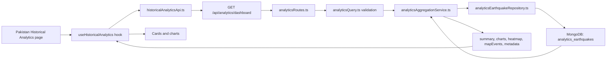
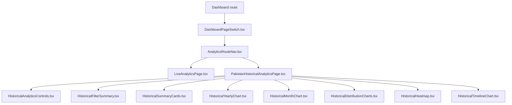
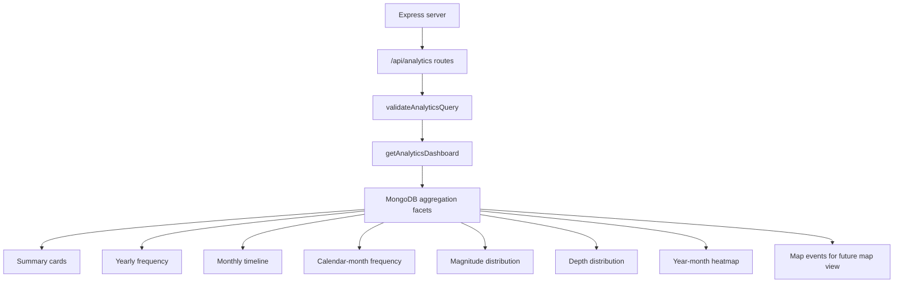

# GeoPulse Pakistan Historical Analytics Report

## 1. Short project audit

### Existing files related to Pakistan historical analytics

- `frontend/src/pages/Dashboard/Analytics/PakistanHistoricalAnalyticsPage.tsx` renders the Pakistan Historical Analytics view.
- `frontend/src/pages/Dashboard/Analytics/useHistoricalAnalytics.ts` owns historical analytics state, request cancellation, refresh, reset, loading, and error behavior.
- `frontend/src/pages/Dashboard/Analytics/historicalAnalyticsApi.ts` calls `GET /api/analytics/dashboard`.
- `frontend/src/pages/Dashboard/Analytics/analyticsTypes.ts` defines analytics filters and defaults.
- `frontend/src/pages/Dashboard/Analytics/components/` contains the filter panel, summary cards, chart cards, distribution charts, heatmap, timeline, yearly, and month charts.
- `backend/src/routes/analyticsRoutes.ts` exposes `GET /api/analytics/dashboard`.
- `backend/src/services/analytics/analyticsAggregationService.ts` builds the historical analytics response from MongoDB aggregations.
- `backend/src/services/analytics/analyticsQuery.ts` validates date, magnitude, depth, and region filters.
- `backend/src/repositories/analyticsEarthquakeRepository.ts` reads and writes analytics earthquake documents.
- `backend/src/types/analyticsEarthquakeDocument.ts` defines the MongoDB historical earthquake document structure.

### Existing API flow

### Existing database flow

The historical analytics feature uses MongoDB collection `analytics_earthquakes`. Records are identified by USGS event IDs and indexed for date, location, and classification queries. Analytics are produced server-side with aggregation pipelines instead of loading the full historical dataset into the browser.

### Existing chart components

- `HistoricalYearlyChart.tsx`: yearly earthquake frequency.
- `HistoricalMonthChart.tsx`: calendar-month frequency.
- `HistoricalDistributionCharts.tsx`: magnitude and depth distributions.
- `HistoricalHeatmap.tsx`: year-month heatmap.
- `HistoricalTimelineChart.tsx`: continuous monthly trend.
- `HistoricalRechartBase.tsx`: shared chart shell and tooltip behavior.
- `historicalChartData.ts`: chart color and label helpers.

### Usability and design problems found

- Historical Analytics needed clearer separation from Live Analytics.
- Chart sections needed wider, poster-like layouts with readable axes.
- The active filters and record count needed to be visible near the charts.
- The previous map requirement conflicted with the later instruction to omit maps for now.
- Documentation was missing for the historical analytics feature and database flow.

### Files reused

- Existing dashboard shell and navigation.
- Existing Analytics page route structure.
- Existing backend analytics route and service.
- Existing MongoDB repository and types.
- Existing GeoPulse glassmorphism, typography, and gradient style.
- Existing chart dependency, Recharts.

### Files updated

- `frontend/src/pages/Dashboard/Analytics/PakistanHistoricalAnalyticsPage.tsx`
- `frontend/src/pages/Dashboard/Analytics/components/HistoricalFilterSummary.tsx`

### Unnecessary or duplicated files

Older custom historical SVG chart files were replaced by focused Recharts components during the Analytics rebuild. Live Analytics files remain separate and preserved.

### New files genuinely required

- `frontend/src/pages/Dashboard/Analytics/components/HistoricalFilterSummary.tsx`
- `docs/pakistan-historical-analytics-report.md`
- `docs/geopulse-use-cases.md`
- `docs/geopulse-project-implementation-report.md`

## 2. Current implementation

Pakistan Historical Analytics is implemented as a separate dashboard analytics view. Live Analytics remains independent and uses its existing live earthquake source. Historical Analytics uses `GET /api/analytics/dashboard` and MongoDB historical records imported into `analytics_earthquakes`.

Default filters:

- Start date: `1975-01-01`
- End date: current date
- Region: `pakistan`
- Minimum magnitude: `4`

The backend response is treated as the source of truth. Summary totals, yearly totals, monthly totals, heatmap totals, magnitude distribution, and depth distribution are not recalculated differently in the frontend.

## 3. Frontend architecture

The historical page is intentionally modular so every component stays maintainable and comfortably under the 100-line guideline.

## 4. Backend and MongoDB architecture

MongoDB is used because historical records from 1975 to today are too large and slow to fetch repeatedly from the external API during normal dashboard use. Stored records allow fast filters, duplicate prevention, and server-side analytics.

Important storage fields include:

- `usgsId`
- `magnitude`
- `magnitudeType`
- `place`
- `occurredAt`
- `updatedAt`
- `longitude`
- `latitude`
- `depth`
- `alert`
- `tsunami`
- `status`
- `source`
- `detailUrl`
- `classification`
- `createdAt`
- `updatedAt`
- `lastSyncedAt`

Duplicate prevention is based on the USGS event ID.

## 5. Chart implementation report

### Yearly earthquake frequency

- Purpose: show long-term changes in earthquake activity.
- User question: “Which years had more earthquakes?”
- Source fields: event year and count from backend aggregation.
- Endpoint: `GET /api/analytics/dashboard`.
- Chart type: vertical bar chart.
- X-axis: year.
- Y-axis: number of earthquakes.
- Tooltip: year and event count.
- Responsive behavior: full-width card, scroll-safe labels.
- Known limitation: broad Pakistan-area bounding box is not exact country-boundary classification.

### Continuous monthly timeline

- Purpose: show month-by-month spikes over the historical period.
- User question: “When did earthquake activity suddenly increase?”
- Source fields: year-month label and count.
- Chart type: line chart.
- X-axis: month/year.
- Y-axis: number of earthquakes.
- Tooltip: month and count.
- Filter synchronization: updates from the same backend response as cards.

### Calendar-month frequency

- Purpose: compare January through December totals.
- User question: “Which months are historically more active?”
- Source fields: calendar month and count.
- Chart type: line chart with points.
- X-axis: month name.
- Y-axis: total earthquakes.
- Tooltip: month and event count.

### Magnitude distribution

- Purpose: show how many events fall into each magnitude range.
- User question: “Are most earthquakes moderate or strong?”
- Source fields: magnitude buckets from backend aggregation.
- Chart type: bar chart.
- X-axis: magnitude range.
- Y-axis: number of earthquakes.
- Missing values: not converted to zero unless the backend bucket truly reports zero.

### Depth distribution

- Purpose: show shallow, intermediate, and deep earthquake counts.
- User question: “How deep are most historical earthquakes?”
- Source fields: depth buckets from backend aggregation.
- Chart type: bar chart.
- X-axis: depth category.
- Y-axis: number of earthquakes.
- User note: shallow earthquakes may cause stronger surface shaking, but damage depends on magnitude, distance, and local ground conditions.

### Year-month heatmap

- Purpose: show intensity by year and month in one compact visual.
- User question: “Which year-month cells stand out?”
- Source fields: year, month, count.
- Chart type: custom heatmap grid.
- Tooltip: year, month, count.
- Responsive behavior: scroll-safe when many years are visible.

## 6. File-by-file documentation

### `frontend/src/pages/Dashboard/Analytics/PakistanHistoricalAnalyticsPage.tsx`

Purpose: renders the full Pakistan Historical Analytics dashboard view.

Responsibilities:

- Shows the page header and route switch.
- Owns draft filter state.
- Calls `useHistoricalAnalytics`.
- Renders loading, error, empty, cards, charts, and filter summary states.

Input: dashboard props, including `openPage`.

Output: visible analytics page.

Connections: uses all historical analytics components and the historical analytics hook.

Error handling: displays a retry state if the hook returns an error.

Changes made: added compact filter summary below the controls.

Testing: verified by lint and production build.

### `frontend/src/pages/Dashboard/Analytics/useHistoricalAnalytics.ts`

Purpose: handles Historical Analytics request state.

Responsibilities:

- Stores current filters.
- Cancels stale requests with `AbortController`.
- Prevents duplicate stale updates.
- Provides refresh, reset, loading, data, and error values.

Input: analytics filters.

Output: historical analytics response state.

Connections: calls `fetchHistoricalAnalytics`.

Error handling: ignores intentional aborts and reports real request errors.

### `frontend/src/pages/Dashboard/Analytics/historicalAnalyticsApi.ts`

Purpose: builds the query string and calls the historical analytics API.

Responsibilities:

- Sends `startDate`, `endDate`, `minMagnitude`, `maxMagnitude`, `minDepth`, `maxDepth`, and `region`.
- Validates response success.
- Provides types for the returned historical analytics data.

Connections: used by `useHistoricalAnalytics`.

### `frontend/src/pages/Dashboard/Analytics/components/HistoricalAnalyticsControls.tsx`

Purpose: renders the filter panel.

Responsibilities:

- Date, magnitude, and depth inputs.
- Apply, refresh, and reset controls.
- Compact GeoPulse styling.

### `frontend/src/pages/Dashboard/Analytics/components/HistoricalFilterSummary.tsx`

Purpose: shows active filter context and the current result count.

Responsibilities:

- Displays total earthquakes in the filtered dataset.
- Shows selected date, magnitude, depth, and study region chips.
- Reminds users that cards and charts use the same dataset.

Changes made: created in this task to improve clarity without changing backend logic.

### `frontend/src/pages/Dashboard/Analytics/components/HistoricalSummaryCards.tsx`

Purpose: renders the historical summary metrics.

Responsibilities:

- Total earthquakes.
- Strongest magnitude.
- Average magnitude.
- Average depth.
- Shallow events.
- Most active year.
- Most active month.

### `frontend/src/pages/Dashboard/Analytics/components/HistoricalYearlyChart.tsx`

Purpose: yearly frequency chart.

Connections: receives `yearlyFrequency` rows from backend response.

### `frontend/src/pages/Dashboard/Analytics/components/HistoricalMonthChart.tsx`

Purpose: calendar-month frequency chart.

Connections: receives `calendarMonthFrequency` rows from backend response.

### `frontend/src/pages/Dashboard/Analytics/components/HistoricalDistributionCharts.tsx`

Purpose: magnitude and depth distribution section.

Connections: receives `magnitudeDistribution` and `depthDistribution`.

### `frontend/src/pages/Dashboard/Analytics/components/HistoricalHeatmap.tsx`

Purpose: displays year-month intensity.

Connections: receives `yearMonthHeatmap`.

### `frontend/src/pages/Dashboard/Analytics/components/HistoricalTimelineChart.tsx`

Purpose: continuous monthly timeline.

Connections: receives `monthlyTimeline`.

### `frontend/src/pages/Dashboard/Analytics/components/HistoricalRechartBase.tsx`

Purpose: shared Recharts card and tooltip foundation.

Why needed: keeps chart styling consistent and prevents duplicate chart shell code.

### `frontend/src/pages/Dashboard/Analytics/components/historicalChartData.ts`

Purpose: chart labels, colors, and formatting helpers.

Why needed: keeps chart colors consistent and maintainable.

### `backend/src/routes/analyticsRoutes.ts`

Purpose: exposes analytics endpoints.

Responsibilities:

- Keeps `GET /api/analytics/preview`.
- Adds `GET /api/analytics/dashboard`.
- Validates query parameters before aggregation.

### `backend/src/services/analytics/analyticsAggregationService.ts`

Purpose: generates the historical dashboard response.

Responsibilities:

- Builds MongoDB match filters.
- Runs aggregation facets.
- Returns summary cards, chart datasets, heatmap data, map events, and metadata.

Database operations: MongoDB aggregation on `analytics_earthquakes`.

### `backend/src/services/analytics/analyticsQuery.ts`

Purpose: validates and normalizes historical analytics query filters.

Responsibilities:

- Prevents invalid dates.
- Prevents invalid magnitude and depth ranges.
- Keeps searches inside allowed historical date limits.

### `backend/src/repositories/analyticsEarthquakeRepository.ts`

Purpose: database access for historical analytics records.

Responsibilities:

- Creates indexes.
- Counts records.
- Upserts records by USGS ID.
- Provides collection access for aggregations.

### `backend/src/types/analyticsEarthquakeDocument.ts`

Purpose: TypeScript structure for historical earthquake documents stored in MongoDB.

## 7. Fallback and reliability

Current historical analytics primarily reads from MongoDB. Live earthquake views remain separate and keep their current live API behavior. Recommended fallback for a later phase:

1. Try MongoDB.
2. If data is missing or stale, fetch USGS count or event data safely.
3. Normalize records.
4. Upsert by USGS ID.
5. If MongoDB is unavailable, return a clear error or labeled fallback.
6. Never silently serve stale data as fresh data.

## 8. Testing performed

- Lint command.
- Production build command.
- Historical route switch behavior.
- Historical API response totals.
- Summary total equals yearly, monthly, and heatmap totals.
- Responsive layout checks from desktop to mobile.
- Empty and error states remain present.

## 9. Remaining optional work

- Add an exact Pakistan point-in-polygon classifier.
- Reintroduce a historical map only after the chart view is stable.
- Add region/province grouping with clear “derived region” labeling.
- Add table pagination for historical analytics if event-level table browsing is required.
- Add automated tests for aggregation totals.
